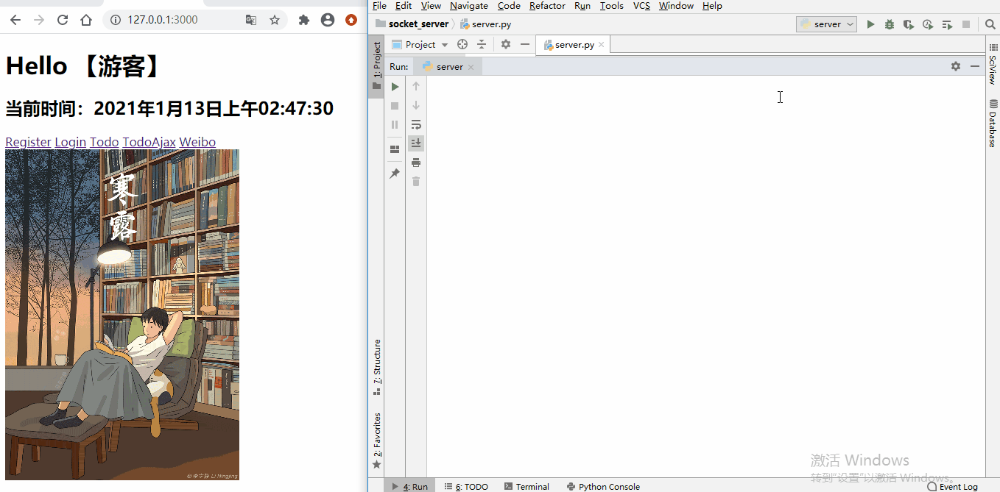
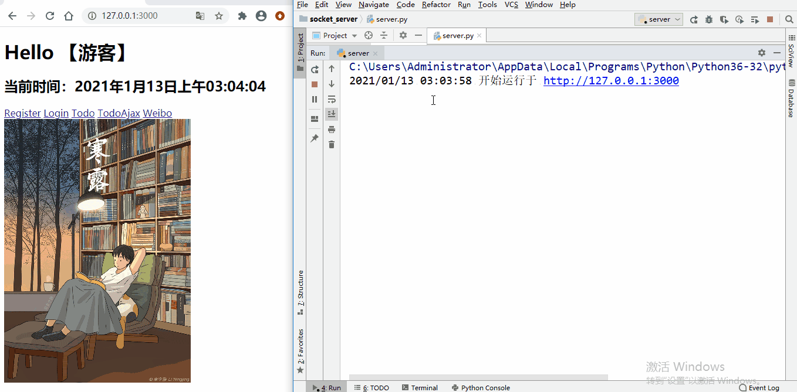
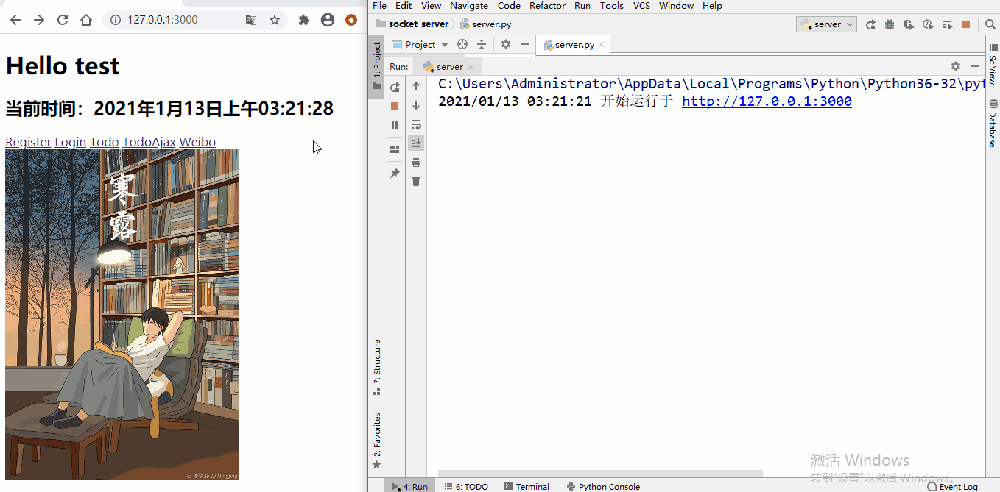
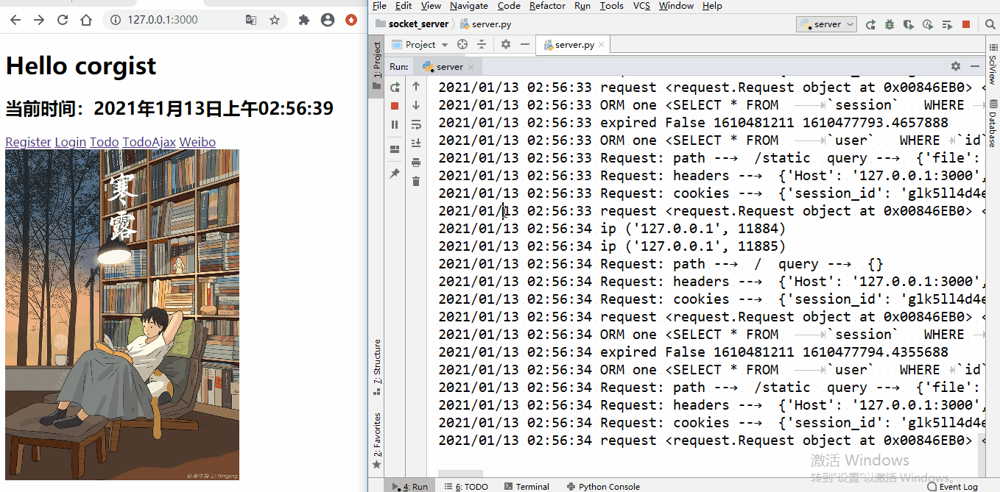


基于Socket 和HTTP 的 Web MVC 框架
================================

## 简介
* 基于`Python`内置标准库`socket`，底层通过`Socket`进行通信，并使用多线程处理并发访问
* 基于字符串操作实现对`HTTP`请求和`HTTP`响应进行监听、收发、解析功能，构建完整的`Web Server`
* 整体的实现基于`MVC`架构，实现数据层，视图层，控制层的解耦，代码可复用高
* 数据层(Model)基于`PyMySQL`实现了自制的`ORM`，封装了`CRUD`接口，同时针对不同的数据操作封装了函数。自制的`ORM`支持事务和`JOIN`语句，解决了`N+1`问题
* 视图层(View)部分使用`JinJa2`模板，通过使用模板简化网页生成，提高开发效率
* 控制层(Controller)使用自制的`Web`框架，主要利用路由字典映射实现了路由注册与路由分发功能，同时实现解析`HTTP`请求、重定向等功能
* 基于该框架实现了一个类微博项目，实现了用户管理(登录、注册)，密码`Hash加盐`保护，`Session`管理
* 实现了微博及其评论的`CRUD`，利用装饰器对用户进行`CRUD`操作的权限控制
* 实现了基于`AJAX`的`Todo`列表，实现无刷新下与服务器交换数据并更新网页内容

## 环境部署
* Windows10

* MySQL

* Python 3.6


## 本地测试
* 需要在本地根目录下添加 secret.py 文件, 内容格式为：

```
mysql_password = 'MySQL数据库密码'
```

## 详细演示
### 登录


### 注册


### 发布微博和评论
权限控制：微博与评论需要登录后才能发布


### 删改微博和评论
权限控制：博主可以删除和修改博文,可以删除评论但不可以修改非自己发布的评论,评论者可以删改自己的评论


### AJAX Todo
基于AJAX的异步处理 实现无刷新下与服务器交换数据并更新网页内容
